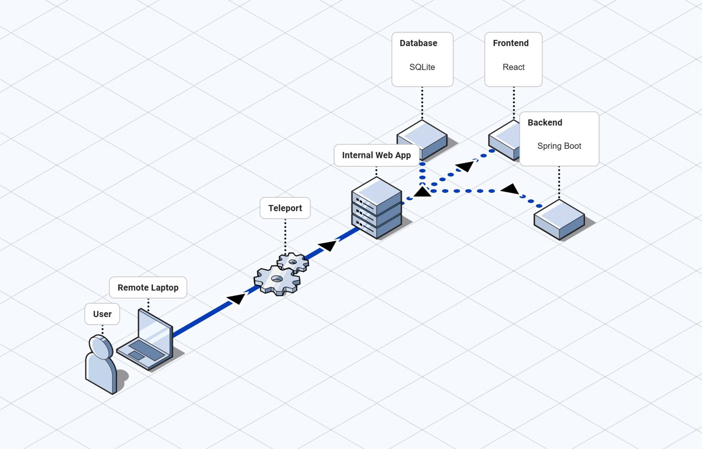
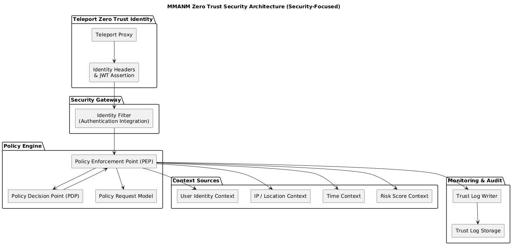

# Secure Warehouse Management System

A security-focused warehouse management application implementing Zero Trust Architecture (ZTA) principles for comprehensive access control and authentication. The system consists of a Java Spring Boot backend with JWT-based authentication and a React frontend with role-based access controls.

## Table of Contents
- [Architecture Overview](#architecture-overview)
- [Technology Stack](#technology-stack)
- [Project Structure](#project-structure)
- [Proposed Model Architecture](#proposed-model-architecture)
- [Security Features](#security-features)
- [Core Spring Security Modules](#core-spring-security-modules)
- [Security Architecture](#security-architecture)
  - [Zero Trust Policy Engine](#zero-trust-policy-engine)
  - [Access Control Logic](#access-control-logic)
  - [Authentication & Authorization](#authentication--authorization)
- [Installation](#installation)
- [Configuration](#configuration)
- [Usage](#usage)
- [API Endpoints](#api-endpoints)
- [Development](#development)
- [Testing](#testing)

## Architecture Overview

The system follows a microservice architecture with:
- **Backend API**: Java Spring Boot application with JWT authentication and Zero Trust security model
- **Frontend UI**: React TypeScript application with role-based access controls
- **Database**: SQLite for data persistence
- **Security Gateway**: Teleport for infrastructure access control

## Technology Stack

### Backend
- **Java 21**: Modern Java runtime
- **Spring Boot 3.2.0**: Framework for building the application
- **Spring Security**: Authentication and authorization
- **JWT (Json Web Tokens)**: For secure authentication
- **Hibernate/JPA**: Object-relational mapping
- **SQLite**: Lightweight database
- **MapStruct**: Type-safe bean mapping

### Frontend
- **React 18**: JavaScript library for UI
- **TypeScript**: Type-safe JavaScript
- **Zustand**: State management
- **React Router**: Client-side routing
- **Chakra UI**: Component library
- **Axios**: HTTP client

### Security Infrastructure
- **Teleport**: Identity-aware access proxy for infrastructure security
- **OAuth 2.0/OpenID Connect**: Identity and access management

## Project Structure

```
MMANM/
├── teleport-test/           # Teleport security infrastructure configuration
│   ├── access.yaml         # Access control policies
│   └── teleport.yaml       # Teleport service configuration
├── warehouse-manager/      # Backend Spring Boot application
│   ├── src/
│   │   ├── main/
│   │   │   ├── java/com/warehouse/warehousemanager/
│   │   │   │   ├── controller/     # REST API controllers
│   │   │   │   ├── security/       # Security configuration and policies
│   │   │   │   │   └── policy/     # Zero Trust policy engine
│   │   │   │   ├── service/        # Business logic
│   │   │   │   ├── repository/     # Data access layer
│   │   │   │   ├── entity/         # Domain models
│   │   │   │   ├── dto/            # Data transfer objects
│   │   │   │   └── config/         # Configuration classes
│   │   │   └── resources/
│   │   │       └── application.properties
│   └── pom.xml
├── Images/                 # Images directory
│   ├── flow.jpg            # System flow diagram
│   ├── interaction.jpg     # Interaction diagram
│   └── network.jpg         # Network architecture diagram
└── warehouse-manager-frontend/  # Frontend React application
    ├── src/
    │   ├── api/            # API service functions
    │   ├── components/     # Reusable UI components
    │   ├── pages/          # Application pages
    │   ├── store/          # Zustand state management
    │   └── hooks/          # Custom React hooks
    ├── package.json
    └── vite.config.ts
```

## Proposed Model Architecture

### Overall Architecture

The proposed model implements a Zero Trust Architecture based on three layers of protection: the user layer, the access gateway layer, and the internal application layer. All access requests must pass through the gateway before reaching the application, ensuring centralized control and eliminating assumptions about internal trusted zones, consistent with the Zero Trust definition in NIST SP 800-207 (NIST, 2020).

The access flow includes three phases: (1) users send requests from the Internet environment; (2) the Zero Trust gateway authenticates identity, establishes access sessions, and attaches identification information to the request; (3) the internal application enforces detailed access policies based on roles and business rules.

In the reference system, Teleport is deployed as an identity-aware proxy, forwarding identity information through fields such as X-Forwarded-User, X-Forwarded-Groups, and JWT assertions before requests are transferred to the backend.

### User Security Layer -- Gateway -> Teleport

The first layer is responsible for verifying identity and establishing valid access sessions. Teleport authenticates users through mechanisms such as SSO/OIDC or internal accounts while issuing short-term certificates to minimize the risk of credential exposure.

Key functions at this layer include:
- Identity authentication and access session establishment;
- Linking identity with device and access context;
- Issuing temporary certificates for the session;
- Recording initial access events for auditing.

The gateway eliminates invalid requests before they reach the application. Once a session is verified, Teleport attaches identification information to the request following the identity-aware proxy model, ensuring the backend only processes requests with valid identity. This reflects the operational mechanism described in the internal report.

### Gateway Security Layer -- Application -> Teleport

This layer remains under Teleport's control. After successful authentication, Teleport continues to maintain its role as an intermediary protector before requests enter the internal system. Key tasks include:
- Checking the validity of access sessions throughout request processing;
- Ensuring every request includes standardized identity information;
- Forwarding identification fields such as X-Teleport-User, X-Forwarded-Email, X-Forwarded-Groups, and JWT assertions;
- Recording access session logs and audit events at the gateway.

At this layer, Teleport serves as a "trust broker," responsible for maintaining and enforcing the initial trust for each request. This is an important distinction from the application layer, where access control is based only on identity verified by Teleport. This forwarding and identity maintenance mechanism is detailed in the internal report.

### Internal Application Security Layer

The final layer belongs to the internal application where detailed access control policies are enforced. The application does not authenticate identity from scratch but uses identification information provided by Teleport to determine user roles and permissions.

At this layer, Spring Security serves as the access control platform, implementing:
- Role-based access control (RBAC) and action-based permissions;
- API protection using filter chains and method or resource-level delegation mechanisms;
- Business logic control to prevent unauthorized access;
- Access decision logging for monitoring and analysis.

In the reference model, the backend Spring Boot application uses resource and action-based authorization mechanisms combined with an access decision logging system (TrustLog) to support auditing and security monitoring.

The multi-layer arrangement ensures that even when identity has been verified by Teleport, users can only perform operations appropriate to their role, adhering to the Zero Trust principle of "least privilege."



## Security Features

### Zero Trust Architecture (ZTA)
- **Never trust, always verify**: All requests must be authenticated and authorized
- **Least privilege**: Access is granted based on minimum required permissions
- **Assume breach**: Network is always treated as hostile

### Multi-layered Security
- **JWT-based Authentication**: Secure token-based authentication with refresh tokens
- **Role-Based Access Control (RBAC)**: Fine-grained permissions based on user roles
- **Context-Aware Access Control**: Time, location, and risk-based access decisions
- **Policy Decision Point (PDP)**: Centralized access control logic
- **Policy Enforcement Point (PEP)**: Runtime access enforcement

### Advanced Security Controls
- **Session Management**: Secure JWT tokens with configurable expiration
- **Password Hashing**: BCrypt for secure password storage
- **CORS Configuration**: Proper cross-origin resource sharing
- **CSRF Protection**: State management protection
- **SQL Injection Prevention**: ORM-based data access

## Core Spring Security Modules

### 1. Authentication Module
- `AuthenticationManager`: Manages the authentication process using configured providers
- `UsernamePasswordAuthenticationToken`: Represents username/password authentication requests
- `CustomUserDetailsService`: Loads user-specific data to perform authentication and authorization

### 2. Authorization Module
- `Method Security`: Enforces security at method level using @PreAuthorize/@PostAuthorize
- `Role-based Access Control (RBAC)`: Uses user roles (USER, ADMIN) to determine access permissions
- `Permission-based Access Control`: Checks fine-grained permissions assigned to users

### 3. Filter Chain Module
- `SecurityFilterChain`: Defines the security filter chain in SecurityConfig
- `UsernamePasswordAuthenticationFilter`: Default Spring Security filter for authentication
- Custom filters inserted before the authentication filter

### 4. Custom Security Filters Module
- `CustomCorsFilter`: Handles CORS configuration and headers
- `TeleportIdentityFilter`: Processes identity from Teleport proxy
- `JwtAuthenticationFilter`: Validates JWT tokens for direct API access

### 5. JWT Security Module
- `JwtUtil`: Handles JWT token generation, validation, and extraction
- `RefreshTokenService`: Manages refresh token lifecycle
- `RefreshTokenRepository`: Persists and retrieves refresh tokens

### 6. Zero Trust Architecture (ZTA) Module
- `PolicyEnforcementPoint (PEP)`: Enforces access decisions based on policy evaluation
- `PolicyDecisionPoint (PDP)`: Evaluates access requests using multiple factors
- `PolicyRequest`: Encapsulates information needed for policy decisions
- Trust Log System: Records all access decisions for auditing

### 7. Access Control Module
- `SecurityConfig`: Main configuration class that defines security rules
- `Session Management`: Configured for stateless sessions (JWT-based)
- URL-based Authorization: Defines access rules for different endpoints

### 8. CSRF Protection Module
- `CSRF Configuration`: Disabled for API-focused application (stateless)

### 9. CORS Module
- `CorsConfigurationSource`: Defines CORS rules for frontend integration
- Cross-origin handling: Configured to work with development and production frontends

### Zero Trust Specific Components:

The application implements a Zero Trust Architecture with these specialized modules:

- Identity Verification: Both Teleport-based and traditional JWT authentication
- Continuous Validation: Policy decisions made on each request
- Context-Aware Access Control: Considers time, location, device, and risk factors
- Trust Scoring: Dynamic risk assessment for each access request
- Audit Trail: TrustLog records for all access decisions

This modular approach allows the system to handle both traditional authentication (JWT-based) and advanced Teleport-based authentication while maintaining strong security controls through the zero-trust framework. Each module plays a specific role in the overall security architecture, working together to implement the principle of "never trust, always verify".

## Security Architecture

### Zero Trust Policy Engine

The system implements a sophisticated policy engine with three main components:

1. **Policy Request (PolicyRequest)**:
   - User information
   - Resource being accessed
   - Action being performed
   - Context information (IP address, time of day, risk score)

2. **Policy Decision Point (PDP)**:
   - Role-based access control (RBAC)
   - Permission-based access control
   - Context-aware access control (time, location, risk)
   - Multi-factor decision logic

3. **Policy Enforcement Point (PEP)**:
   - Runtime access enforcement
   - Integration with Spring Security framework
   - HTTP request interception and validation

### Access Control Logic

#### Role-Based Access Control
- **Admin users** can access all system resources
- **Regular users** have limited access based on configured permissions

#### Context-Aware Access
- Time-based restrictions (e.g., users restricted during night hours)
- Location-based access (IP address validation)
- Risk-based scoring for access decisions

#### Permission-Based Access
- Fine-grained permissions in the format `resource:action`
- Dynamic permission management
- Inheritance and delegation mechanisms

#### Authentication Flow

1. User submits credentials to `/api/auth/login`
2. Authentication manager validates credentials
3. JWT token is generated with appropriate claims
4. Refresh token is created for session management
5. User context is established in security context
6. Policy enforcement begins for subsequent requests

#### Token Management

- **Access Tokens**: Short-lived JWT tokens (1 hour default)
- **Refresh Tokens**: Longer-lived tokens (7 days default) for secure session renewal
- **Automatic Refresh**: Frontend automatically refreshes expired access tokens
- **Secure Storage**: Tokens stored securely in browser storage with appropriate security measures

### Authentication & Authorization

#### JWT Token Structure
- **Subject**: Username
- **Issued At**: Token creation time
- **Expiration**: Configurable token lifetime
- **Signature**: HS512 algorithm with secure secret key

#### Security Headers
- CORS configured for cross-origin requests
- CSRF protection enabled
- Content Security Policy (CSP) headers
- HTTP Strict Transport Security (HSTS)

#### Password Security
- Passwords are hashed using BCrypt algorithm
- Configurable work factor for password hashing
- Automatic salting for password security




## Installation

### Prerequisites
- Java 21 SDK
- Node.js 18+ and npm
- Maven 3.6+

### Backend Setup

1. Navigate to the backend directory:
```bash
cd warehouse-manager
```

2. Build the application:
```bash
mvn clean install
```

3. Run the application:
```bash
mvn spring-boot:run
```

The backend will be available at `http://localhost:8081`

### Frontend Setup

1. Navigate to the frontend directory:
```bash
cd warehouse-manager-frontend
```

2. Install dependencies:
```bash
npm install
```

3. Start the development server:
```bash
npm run dev
```

The frontend will be available at `http://localhost:54321` (or the next available port)

## Configuration

### Backend Configuration

The backend application is configured via `src/main/resources/application.properties`:

```properties
# Server configuration
server.port=8081

# Database configuration
spring.datasource.url=jdbc:sqlite:warehouse.db
spring.datasource.driver-class-name=org.sqlite.JDBC
spring.jpa.database-platform=org.hibernate.community.dialect.SQLiteDialect
spring.jpa.hibernate.ddl-auto=update

# JWT Configuration
app.jwtSecret=warehouseManagerSecretKeyForJWTTokenGenerationAndValidationThatIsLongEnoughForHS512Algorithm
app.jwtExpirationInMs=3600000
app.refreshTokenExpirationInMs=604800000

# Security defaults
security.default-admin-username=admin
security.default-admin-password=admin123
```

### Security Configuration

Security is implemented in multiple layers:

1. **Transport Security**: All API endpoints require authentication except login and registration
2. **Session Management**: Stateless authentication using JWT tokens
3. **Access Control**: Role-based and context-aware access controls
4. **Policy Engine**: Centralized policy decision and enforcement points

## Usage

### Default Credentials
- **Username**: admin
- **Password**: admin123

### Available Roles
- **ADMIN**: Full system access, user management, and system configuration
- **USER**: Limited access to products, imports, and exports (no user management)

### API Endpoints

#### Authentication
- `POST /api/auth/login` - User login and token generation
- `POST /api/auth/register` - User registration
- `POST /api/auth/refresh` - Token refresh

#### User Management (Admin only)
- `GET /api/users` - Get all users
- `GET /api/users/{id}` - Get user by ID
- `POST /api/users` - Create new user
- `PUT /api/users/{id}` - Update user
- `DELETE /api/users/{id}` - Delete user

#### Product Management
- `GET /api/products` - Get all products
- `GET /api/products/{id}` - Get product by ID
- `POST /api/products` - Create new product
- `PUT /api/products/{id}` - Update product
- `DELETE /api/products/{id}` - Delete product

#### Import/Export Operations
- `GET /api/imports` - Get all imports
- `POST /api/imports` - Create new import
- `GET /api/exports` - Get all exports
- `POST /api/exports` - Create new export

## Development

### Backend Development
- Use your preferred Java IDE (IntelliJ IDEA, Eclipse, VS Code)
- Code generation with MapStruct
- Lombok for reducing boilerplate code
- Maven for dependency management

### Frontend Development
- TypeScript for type-safe development
- React hooks for state management
- Zustand for global state
- Chakra UI for consistent design system
- Vite for fast development builds

### Security Testing
- Unit tests for security components
- Integration tests for authentication flows
- Policy evaluation testing
- Access control validation

## Testing

### Backend Tests
```bash
cd warehouse-manager
mvn test
```

### Frontend Tests
```bash
cd warehouse-manager-frontend
npm test
```

### Security Testing Considerations
- Penetration testing for authentication bypass
- JWT token validation and expiration testing
- Authorization logic validation
- Input validation and injection prevention
- Session management testing

## Deployment

### Production Configuration
- Secure JWT secret keys
- Proper HTTPS configuration
- Database security hardening
- Firewall and network security
- Monitoring and logging

### Security Best Practices
- Regular security audits and updates
- Vulnerability scanning
- Proper access logging
- Incident response procedures
- Regular backup and recovery testing

## Contributing

1. Fork the repository
2. Create a feature branch
3. Make security-focused changes with proper tests
4. Submit a pull request with detailed security implications
5. Ensure all security tests pass

## License

This project is security-focused and implements Zero Trust Architecture principles for comprehensive access control.

## Support

For security-related issues or questions about the Zero Trust implementation, please consult the documentation or open an issue in the repository.

---
*This project demonstrates a comprehensive approach to implementing Zero Trust Architecture in a warehouse management system, focusing on security-first design principles.*